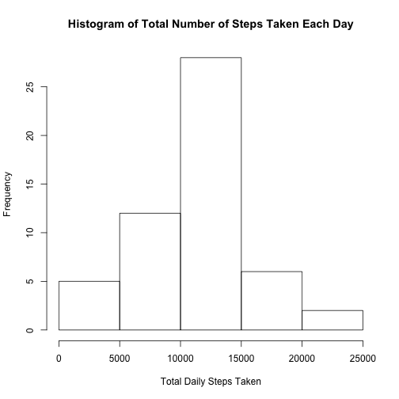
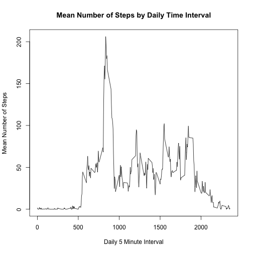
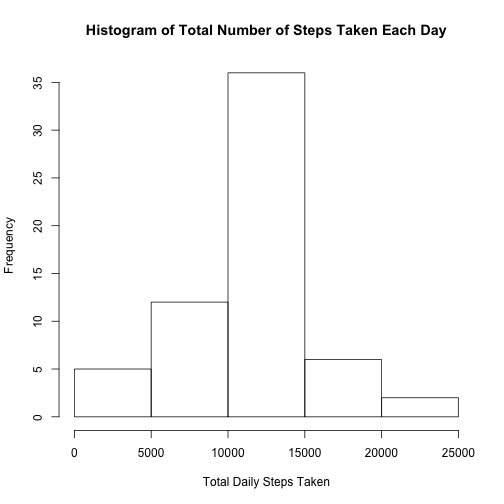
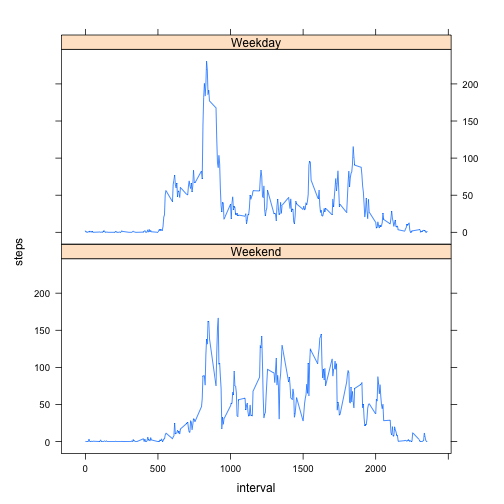

# Reproducible Research: Peer Assessment 1

## Loading and preprocessing the data

Loading the data using read.cvs() assuming that the cvs file 'activity.cvs' is in the working directory.


```r
data <- read.csv('activity.csv')
```


Data Processing: 
Using the aggregate function to calculate the sum of steps by date for the activity data. NA values will be ignored.


```r
stepsByDate <- aggregate(steps ~ date, data = data, sum, na.rm = TRUE)
```

Using the aggregate function to calculate the mean of steps by time interval for the activity data. NA values will be ignored.


```r
stepsByTimeInterval <- aggregate(steps ~ interval, data = data, mean, na.rm = TRUE)
```

## What is mean total number of steps taken per day?

Below is a histogram of the total number of steps taken each day.


```r
hist(stepsByDate$steps, main = "Histogram of Total Number of Steps Taken Each Day", xlab = "Total Daily Steps Taken")
```

 

Calculating the mean and median total number of steps taken per day.


```r
mean(stepsByDate$steps)
```

```
## [1] 10766.19
```

```r
median(stepsByDate$steps)
```

```
## [1] 10765
```

The mean total steps taken per day is 10766.19.

The median total steps taken per day is 10765.

## What is the average daily activity pattern?

A time series plot of the 5-minute interval and the average number of steps taken, averaged across all days is below.


```r
plot(steps ~ interval, data=stepsByTimeInterval, type="l", main = "Mean Number of Steps by Daily Time Interval", xlab="Daily 5 Minute Interval", ylab="Mean Number of Steps")
```

 


```r
maxRow <- which.max(stepsByTimeInterval$steps)

stepsByTimeInterval[maxRow, ]$interval
```

```
## [1] 835
```

The 835th interval has on average across all the days in the dataset the maximum number of steps.

## Inputing missing values

There are a number of days and intervals in the dataset with missing values (denoted as NA). These missing values may introduce bios into some of the calculates and summaries of the data. 


```r
sum(is.na(data$steps))
```

```
## [1] 2304
```

There are 2304 rows with missing values (NA) in the dataset.

The mean for that 5-minute interval will be used to replace the missing values in the dataset. 


```r
#copy the original dataset
completedDataset <- data

#get the number of rows to loop over
numberOfRows <- nrow(completedDataset)

for (i in 1:numberOfRows) {
  #if the row has a missing value, then get the median for that interval and
  #replace the missing value
  if (is.na(completedDataset[i, ]$steps)) {
      
    #get the median number of steps for that interval
    requestedInterval = completedDataset[i, ]$interval
      
    medianStepsForInterval <- stepsByTimeInterval[stepsByTimeInterval$interval == requestedInterval, ]$steps
    
    completedDataset[i, ]$steps <- medianStepsForInterval
    }
}
```

Using the aggregate function to calculate the sum of steps by date for the activity data with completed missing values.

Below is a histogram of the total number of steps taken each day using the dataset with completed missing values.


```r
stepsByDateCompleted <- aggregate(steps ~ date, data = completedDataset, sum)

hist(stepsByDateCompleted$steps, main = "Histogram of Total Number of Steps Taken Each Day", xlab = "Total Daily Steps Taken")
```

 

Calculating the mean and median total number of steps taken per day for the activity data with completed missing values.


```r
mean(stepsByDateCompleted$steps)
```

```
## [1] 10766.19
```

```r
median(stepsByDateCompleted$steps)
```

```
## [1] 10766.19
```

The mean total steps taken per day is 10766.19.

The median total steps taken per day is 10766.19.

The mean and median for the dataset with completed missing values are the same unlike in the first part of the report. The overall impact of replacing the missing values is minimal. However, a difference is more evident when inspecting specific time intervals.


## Are there differences in activity patterns between weekdays and weekends?

Adding a new day of the week factor variable in the dataset to denote if a date is a weekday or a weekend.


```r
#look at the date, if weekdays(as.Date(date)) == "Sunday" or "Saturday", then Weekend, else Weekday 

completedDataset$day <- ifelse((weekdays(as.Date(completedDataset$date)) == "Sunday" | weekdays(as.Date(completedDataset$date)) == "Saturday"), "Weekend", "Weekday")

completedDataset$day = factor(completedDataset$day, levels = c("Weekend", "Weekday"))
```

Below is a panel plot containing a time series plot of the 5-minute interval and the average number of steps taken, averaged across all weekday days or weekend days.


```r
#load the lattice library, if not already loaded
library(lattice)

stepsByTimeIntervalCompleted <- aggregate(steps ~ interval + day, data = completedDataset, mean)

xyplot(steps ~ interval | factor(day), data = stepsByTimeIntervalCompleted, aspect = 1/2, type = "l")
```

 
